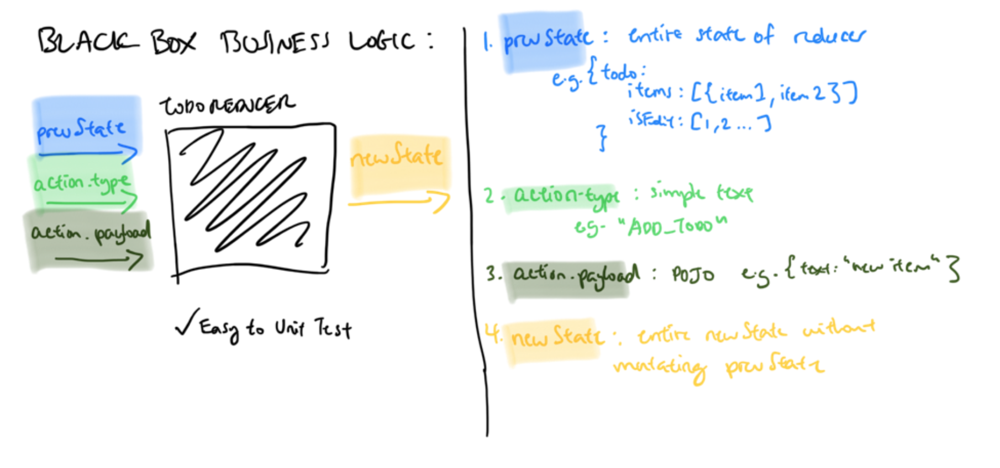

# React & Redux: A Visual Explanation

> [Click here for github repo of todoapp](https://github.com/howardmann/react-projects/tree/master/todoapp) and [here for live demo of app](mannhowietodoapp.surge.sh)

A visual explanation of React & Redux using the classic Todo App teaching exercise. 
## 1. Overview of TodoApp
While simple, our Todo App covers all the core frontend features of: CRUD, filtering and live reload.

## 2. Break Into Components
Our root App component will contain all the state and logic and will pass this down to its child components.

Separate each child component by a given responsibility:
1. `<APP/>` Stores our state, actions and renders all immediate children
2. `<NEW_TODO_FORM/>` Accepts text input and triggers "ADD" todo action
3. `<FILTER/>` Changes what items we want to display ("SHOW_ALL" or "SHOW_DONE")

> *Optional: Do not separate out `<NEW_TODO_FORM/>` and `<FILTER/>` into children components if logic is simple and instead keep within `<APP/>`*

4. `<TODOLIST/>` maps over filtered todo items and renders either `<TODO_ITEM/>` or `<EDIT_TODO_FORM/>`
5. `<TODO_ITEM/>` renders the item and includes key action handlers such as mark as done, edit and delete
6. `<EDIT_TODO_FORM/>` renders the input as an input form with its own internal state. Note: we create this as a separate component as we require the feature to undo the edit and only update the state if "Update" button is clicked

## 3. Data Down Actions Up (DDAU)
React follows the principle of Data Down Actions Up (DDAU):

1. All/ Majority of application state is stored in a root parent component as a POJO. Also, action callbacks to change state are stored in the parent component
2. Parent then passes down the relevant state and action callbacks to its children as `props`
3. Children components render the `props` and listen for UI events to trigger action callbacks
4. Parent components then execute the callback functions to change state
5. React then does the heavy-lifting to update the UI only for the state that has changed

## 4. Create our State (aka: the source of truth)
All dynamically rendered content should be kept in the state:

All items should be kept in an items array as a single source of truth. 

To filter data, create a helper function to render the items array based on what filter type is in the state - ***Do not duplicate state data***.

Decide whether a `<TODO_ITEM/>` vs. `<EDIT_TODO_FORM>`is rendered by creating an array of items that are marked as edit `isEdit: [4...]`.

## 5. Identify Action Handlers
Identify key UI locations where we will trigger changes to state:

## 6. Separate out Business Logic
Create a reducer which will be the black box handling our business logic. This is the basic principle of Redux:

The reducer accepts three paramaters:
1. `prevState`: the entire state that this reducer is responsible for handling
2. `action.type`: simple text instruction for our reducer to execute relevant function e.g. `"ADD_TODO"`
3. `action.payload`: payload options our action.type and function requires to modify state

A new state is then created without mutating previous state. This business logic is easy to unit test and independent of framework. We then require the reducer to update the state of our components.

*Fin*
***

#### Further reading materials with code:
- [React tutorial](https://reactjs.org/docs/hello-world.html)
- [Redux tutorial](https://redux.js.org/basics/basic-tutorial)
- [You don't need redux](https://medium.com/@dan_abramov/you-might-not-need-redux-be46360cf367)
- [Code your own combineReducer](https://blog.jakoblind.no/code-your-own-combinereducers/)

